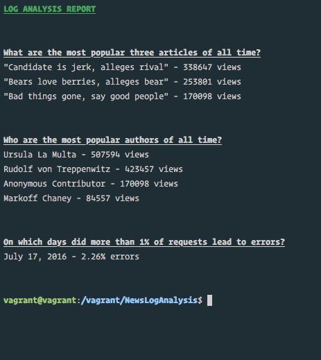

# News Website Log Analysis

Internal reporting tool for a newspaper website that generates a report using the information from a large database (containing millions of records) to discover what kind of articles the site's readers like. The database contains newspaper articles, as well as the web server log for the site. The log has a database row for each time a reader loaded a web page.

## Installation Instructions

1. Install Linux virtual machine & dependencies (Optional if you know what you are doing, i.e. can provide a similar environment without VM)
    1. Install [Vagrant](https://www.vagrantup.com/)
    2. Install [VirtualBox](https://www.virtualbox.org/)
    3. Clone vagrant setup files from [Udacity's Github](https://github.com/udacity/fullstack-nanodegree-vm).
    4. Change to `vagrant` directory.
        1. Whatever you add here would be accessible from VM in it's `/vagrant` directory.
    5. Start/Build VM: 
        ```shell 
        $ vagrant up
        ```
    6. Connect to VM: 
        ```shell 
        $ vagrant ssh
        ```
2. Clone this project & navigate to the project directory.
3. Download & unzip the [database](https://d17h27t6h515a5.cloudfront.net/topher/2016/August/57b5f748_newsdata/newsdata.zip).
    1. You may use `wget` or `curl` to download the database file directly on VM.
4. Load the database: 
    ```shell 
    $ psql -d news -f newsdata.sql
    ```
5. Generate the report: 
    ```shell 
    $ python log_analysis.py
    ```

## Report


